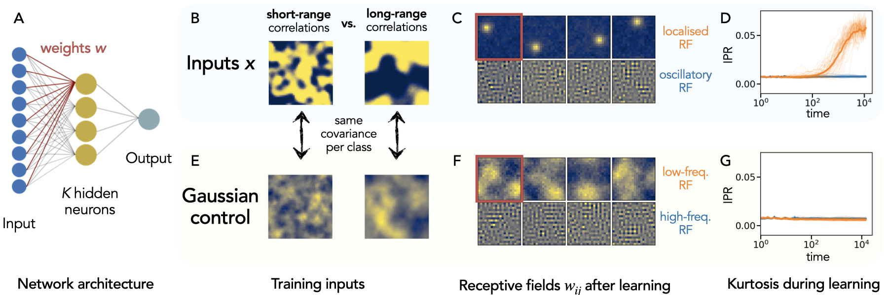

# conv_emerge

This respository contains code to accompany the paper "Data-driven emergence of convolutional structure in neural networks" [arXiv][https://arxiv.org/abs/2202.00565] by A. Ingrosso and S. Goldt.

## Overview



## Usage

This package contains a utilities:

- ```inputs.py``` defines various input models, such as Gaussian process,
  non-linear Gaussian process, etc.
- ```tasks.py``` defines various tasks, for example mixture classification tasks
  like the ones analysed in the paper
- ```network.py``` defines the neural network models that we train
- ```utils.py``` contains some helper functions

Simulations of online learning, like the ones shown in the figure above, can be
obtained by simulating online learning with ```conv_emerge_online.py```.

To get an overview of the different parameters, run 
```
python conv_emerge_online.py --help
```

## Requirements

To run the code, you will need up-to-date versions of

- pyTorch
- numpy

